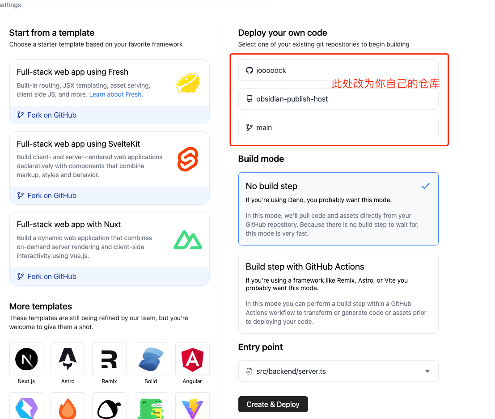

<div align="center">

<h1 align="center">Obsidian Publish Host for Free</h1>

[English](./README.md) / 简体中文

免费的 Obsidian Publish 托管服务，采用官方 Publish UI
</div>

## 示例

[官方文档 Demo](https://obs.deno.dev)

## 已知的缺失功能：

- 反链显示
- 关系图谱(存在bug)
- 密码功能

## 部署教程

> 本地需要安装 deno 环境，查看安装教程 https://docs.deno.com/runtime/manual

### 1. Fork 项目到本地

### 2. 拷贝 Markdown 文件并生成 cache 数据
将 Obsidian 仓库(vault)里面需要发布的文件(包括 markdown 引用的资源文件)拷贝到项目根目录下面的`vault`目录中，然后执行下面的命令生成 cache 数据：
```shell
deno task parse
```
或者
```shell
node run parse
```

> 本仓库下面自带的 `vault` 目录为官方文档对应的 markdown 文件，自行部署时可以删除，但每次修改这个目录后都需要重新执行上面的命令生成新的的 cache 数据。

### 3. 本地预览(可选)
```shell
deno task dev
```
或者
```shell
node run dev
```

### 4. 提交到github

### 5. 创建 deno deploy 项目并关联

> 后续会支持发布到更多平台

在 [这里](https://dash.deno.com/new) 创建一个 Deno Deploy 项目，对应配置改为你自己 fork 的 github 仓库：


之后修改 markdown 后只需要 push 到 github，deno 会自动重新发布。

## 配置

配置文件位于`src/backend/options.ts`，支持以下配置：
```ts
interface Options {
    // 网站左上角显示的名称
    siteName: string
    
    // 网站首页加载的文件
    indexFile: string
    
    // 默认主题
    defaultTheme: "light" | "dark" | "system"
    
    // 是否显示主题切换组件
    showThemeToggle: boolean
    
    // 是否显示 Hover 预览
    showHoverPreview: boolean

    // Limit maximum line length.
    // Fits less content on the screen, but makes long paragraphs more readable.
    readableLineLength: boolean
    
    // Markdown specs ignore single line breaks in reading view.
    // Turn this off to make single line breaks visible.
    strictLineBreaks: boolean

    // 是否隐藏页面内标题
    hideTitle: boolean
    
    // 是否在左侧显示所有发布的文章
    showNavigation: boolean
    
    // 是否显示搜索组件
    showSearch: boolean
    
    // 是否显示文章目录/大纲
    showOutline: boolean
    
    // 是否显示反链
    showBacklinks: boolean
    
    // 是否显示关系图谱
    showGraph: boolean

    // 滑动窗口模式
    slidingWindowMode: boolean
}
```


## 后续开发

- 实现上面缺失的功能
- 开发插件以便在ob中即可发布
- 实现单文档密码与整站密码分离

## 感谢

如果你喜欢本项目，欢迎 Star，或者请我喝杯咖啡，谢谢！

[](https://ko-fi.com/Y8Y3VBAML)
