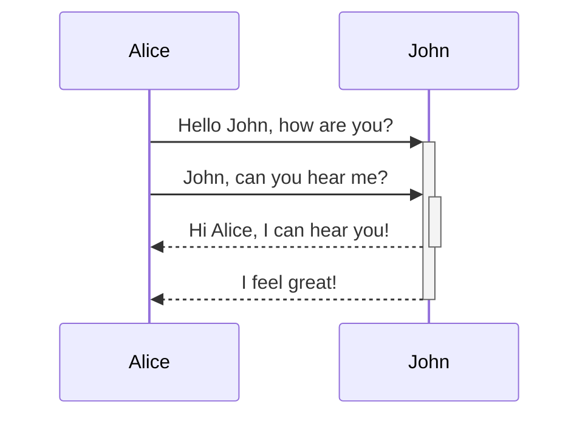
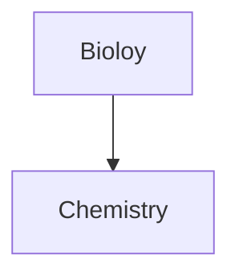
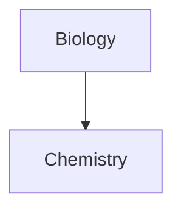

---
tags:
  - sample
  - md
aliases:
  - sp
link: "[[Audio Recorder]]"
---
# Basic formatting syntax

This is a paragraph.

This is another paragraph.

# This is a heading 1
## This is a heading 2
## This is a heading 3

**Bold text**
__Bold text__
*Italic text*
_Italic text_
~~Striked out text~~
==Highlighted text==
**Bold text and _nested italic_ text**
***Bold and italic text***

[[View|alias]]
[View](View)

[Obsidian Help](https://help.obsidian.md)

[My Note](<obsidian://open?vault=MainVault&file=My Note.md>)


> Human beings face ever more complex and urgent problems, and their effectiveness in dealing with these problems is a matter that is critical to the stability and continued progress of society.

\- Doug Engelbart, 1961


- First list item
- Second list item
- Third list item

1. First list item
2. Second list item
3. Third list item

- [x] This is a completed task.
- [ ] This is an incomplete task.

***

Text inside `backticks` on a line will be formatted like code.

```
cd ~/Desktop
```

```js
function funcyAlert(arg) {
  if (arg) {
    $.facebox({div: '#foo'})
  }
}
```

This is a simple footnote[^2].

[^1]: This is the referenced text.
[^2]: Add 2 space at the start of each new line.
  This lets you write footnotes that span multiple lines.
  [^note]: Named footnotes still appear as numbers, but can make it easier to identify and link references.

---

This is an %%inline%% comment.

%%
This is a block comment.

Block comments can span multiple lines.
%%

- - -

| First name | Last name |
| ---- | ---- |
| Max | Planck |
| Marie | Curie |

 First name | Last name 
 ---- | ---- 
 Max | Planck 
 Marie | Curie 

First column | Second column
-- | -- 
[[Basic formatting syntax\|Markdown syntax]] | ![[og-image.png\|200]]








$$
\begin{vmatrix}a & b\\
c & d
\end{vmatrix}=ad-bc
$$

This is an inline math expression $e^{2i\pi} = 1$.

---

[[caminandes-llamigos.mp4|mp4]]

![[caminandes-llamigos.mp4|video]]

> [!info]
> hello

![[Audio Recorder#^bbebd5]]

